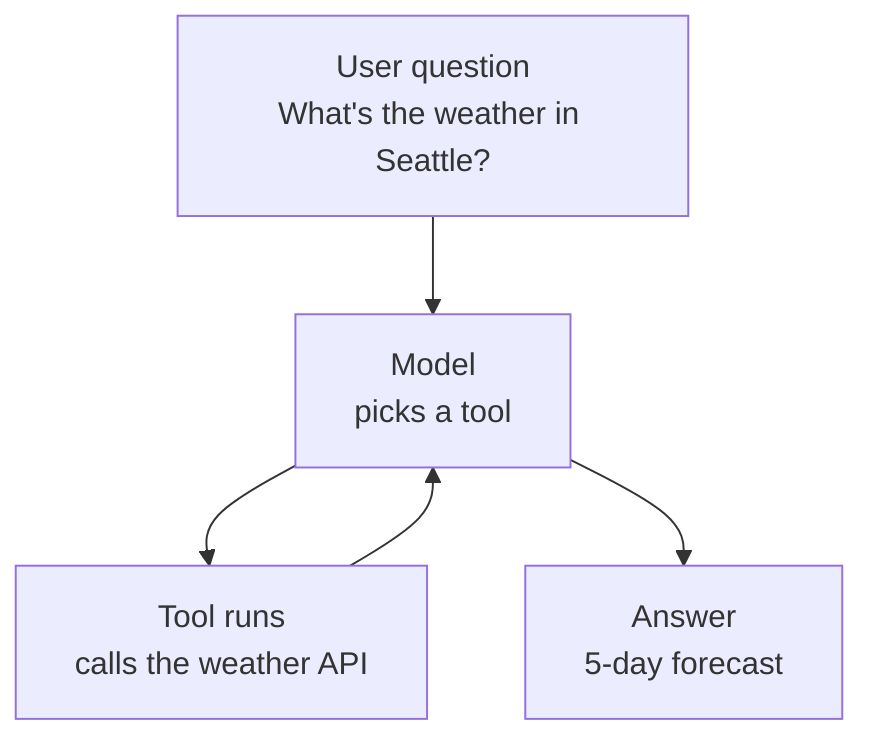
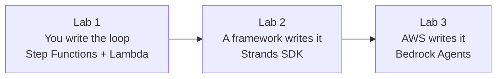
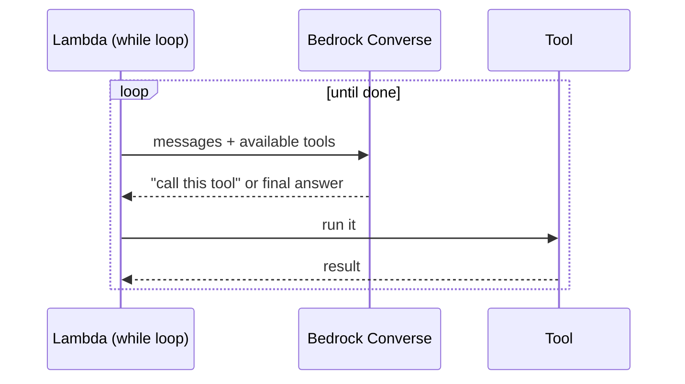
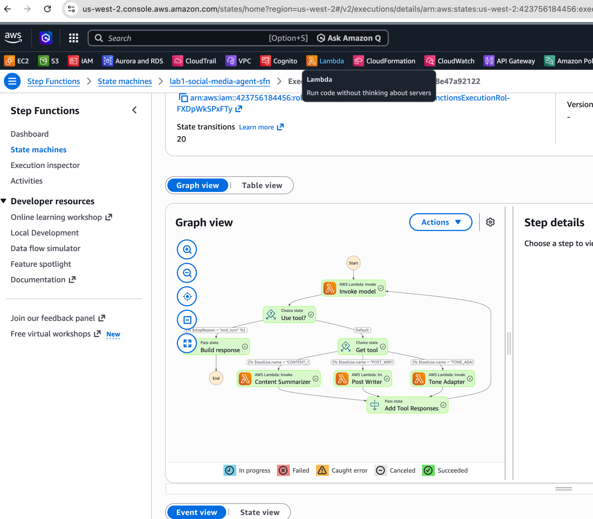
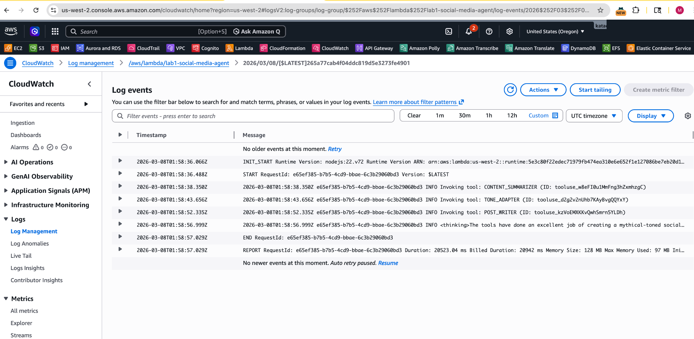
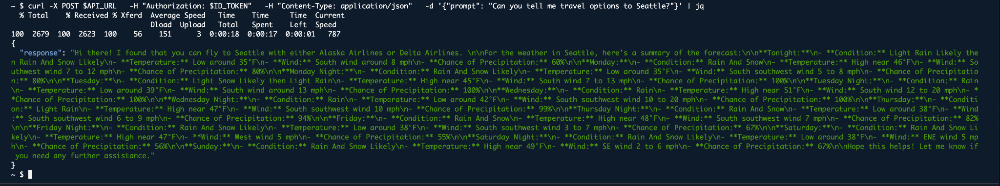
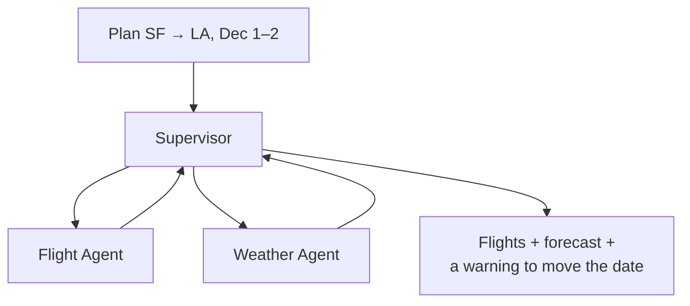
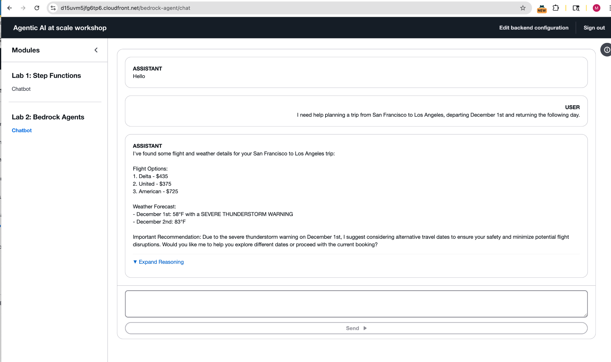

# Agentic AI Workflows on AWS

**One agent, built three ways — to see what you give up each time you let something else drive the loop.**

---

## What an agent is

Not a chatbot. A loop.



The model isn't told which tool to use. It reads the question, decides, calls, looks at the result, and goes around again until it can answer. No `if` statements anywhere.

## The question this project asks

Someone has to write that loop. The interesting part is **who**.



Left to right: less code to maintain, less visibility into what happened.

| | Lab 1 | Lab 2 | Lab 3 |
|---|---|---|---|
| **Orchestration** | Your own `while` loop | Strands Agents SDK | Bedrock Agents (Supervisor) |
| **You control** | Every state and retry | Tools and prompt | Configuration only |
| **Code to write** | Most | Some | Almost none |
| **When it breaks** | You can see exactly where | Framework logs | Hardest to trace |
| **Best for** | Auditability | Everyday building | Scale |

Labs 2 and 3 plan trips. Lab 1 runs a content pipeline — the comparison is about the loop, not the domain.

---

## What it actually does

Real exchanges with Lab 2, through `POST /chat` — Cognito-authenticated, session keyed to the username.

| Ask | What happens underneath |
|---|---|
| *What are the flight options to Seattle?* | Model picks `flight_search` and passes `"Seattle"` on its own |
| *What's the weather forecast for Seattle?* | Two chained calls to the National Weather Service, returned as one answer |
| *Any local things to do?* | Seattle is never repeated — session memory in S3 carries it |
| *Tour operators with water activities?* | Answers only from the S3-indexed partner list, not general knowledge |
| *Reserve the Space Needle, Dec 20, 9 AM* | Creates a real reservation over MCP — the one that writes |

That last row is the one worth testing hardest. Everything above it is reversible; that one isn't.

---

## Lab 1 — You write the loop

A Lambda calls the Bedrock Converse API, checks whether the model asked for a tool, runs it, feeds the result back, and repeats. Step Functions draws the whole thing as a state machine, so every transition is visible.



**Result:** routed correctly through three tool calls in one execution, each step visible in the graph and the logs.




## Lab 2 — A framework writes it

Declare a model, a prompt, and a list of tools. The SDK handles reasoning, tool dispatch, and memory.

```python
travel_agent = Agent(
    model="us.amazon.nova-lite-v1:0",
    system_prompt=TRAVEL_AGENT_PROMPT,
    tools=[flight_search, http_request, retrieve, *mcp_tools],
    session_manager=session_manager,  # S3-backed memory
)
```

Two things make this more than a tool-calling demo:

- **RAG** — a Bedrock Knowledge Base over private S3 data, reached through the built-in `retrieve` tool
- **MCP** — tools discovered at runtime from an external server (AgentCore Gateway, OAuth2 via Cognito), so new tools appear without redeploying

**Result:** authenticated to the gateway, pulled flights and a multi-day forecast, and answered with both — from one prompt, with no orchestration code.



## Lab 3 — AWS writes it

A Supervisor agent, configured rather than coded, delegates to two specialists.



**Result — the interesting one:** the Weather Agent returned a severe thunderstorm warning for Dec 1. The Supervisor didn't just print both answers side by side — it noticed the conflict with the flight options and recommended changing the date.



That's the behaviour worth building for: not chaining tool calls, but weighing their results against each other.

---

## Built with

Amazon Bedrock (Nova Lite, Claude 3.5) · AWS Lambda · Step Functions · Strands Agents SDK · Bedrock Knowledge Bases · S3 · MCP via AgentCore Gateway · Bedrock Agents · API Gateway · Cognito · CloudWatch

## What's in this repo

```
README.md
docs/screenshots/    execution evidence for all three labs
```

The labs were built and run in AWS following the workshops linked below, then torn down to avoid standing costs. Deployable source lives in those workshops. What's mine is the comparison, the testing, and the analysis.

## What I'd do next

- Cache the MCP OAuth2 token instead of re-authenticating on every invocation
- Fix error handling: an unsupported city raises inside the tool and comes back as a generic 500, indistinguishable from a throttle or an auth failure
- Replace console testing with an automated eval suite — assert on which tools were called, not just the final text, and count side effects rather than trusting the response

## Attribution

Based on AWS's official agentic AI workshops (Strands Agents SDK, Bedrock, Step Functions, Bedrock Agents). The comparison, testing, and analysis are my own.

Built by [Mayu Kataoka](https://github.com/mayukataoka) — quality engineering background, exploring applied AI systems.
