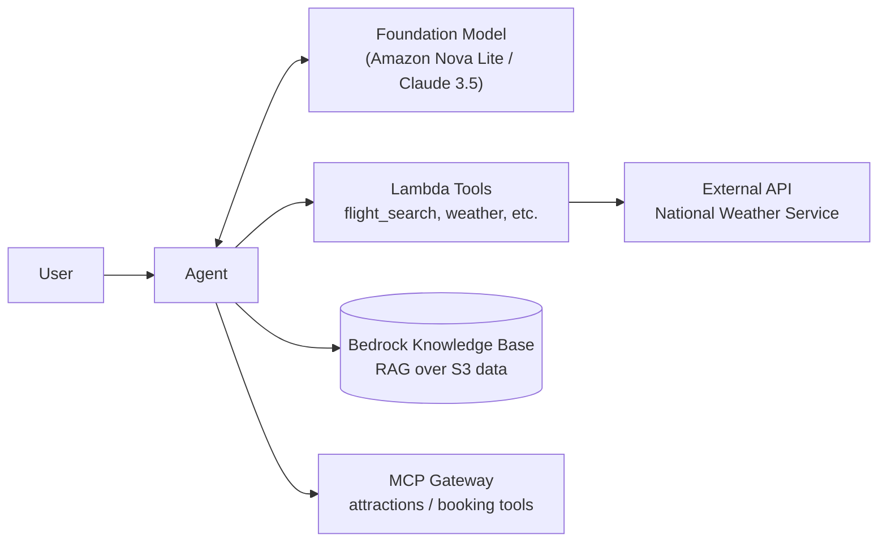
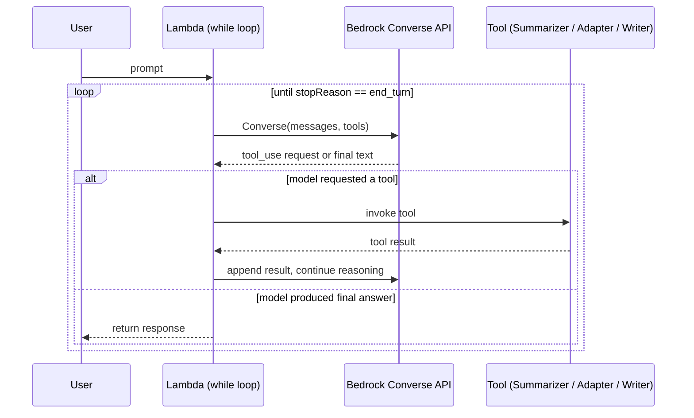
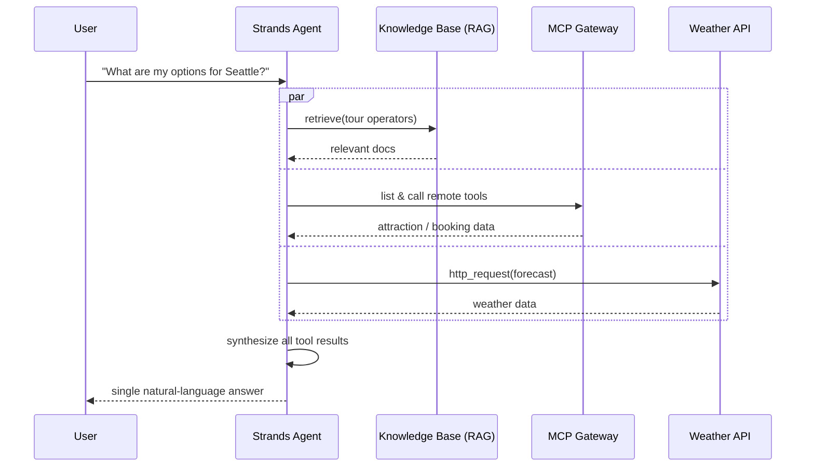
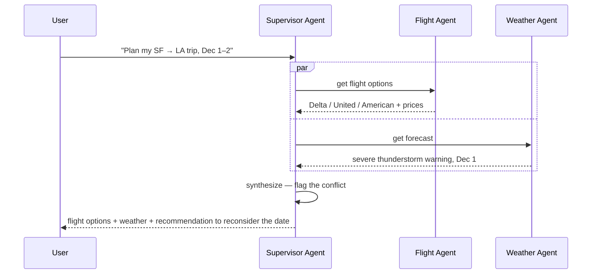
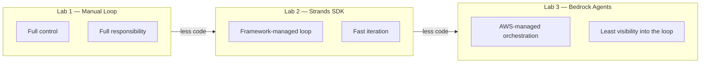

# Agentic AI Workflows on AWS

**Comparing three ways to build an AI agent — a hand-rolled reasoning loop, an SDK-managed agent, and a fully managed multi-agent system — through working examples on AWS.**

Most tutorials show you one way to build an agent. This project implements the *same loop* three times, using three different orchestration approaches, to understand the actual trade-offs between control, development speed, and visibility — not just read about them.

---

## Overview

An "agent" is a loop: a model reasons about a request, decides whether it needs a tool, calls that tool, incorporates the result, and repeats until the task is done. How much of that loop *you* write, versus how much a framework or managed service writes for you, is a decision I wanted to understand by building it rather than reading about it.

This project implements that loop three ways on AWS:

| # | Pattern | Orchestration | Key takeaway |
|---|---|---|---|
| 1 | **Manual reasoning loop** | Raw Python `while` loop + AWS Step Functions, calling the Bedrock Converse API directly | You own every state, retry, and tool call. Maximum control, maximum responsibility. |
| 2 | **SDK-driven agent** | [Strands Agents SDK](https://strandsagents.com) on AWS Lambda | The framework manages the loop, session memory, and tool-calling. Clean code, fast iteration. |
| 3 | **Managed multi-agent** | Amazon Bedrock Agents, Supervisor + collaborator pattern | AWS manages orchestration between a Supervisor and specialized sub-agents. High scalability, less visibility into the reasoning path. |

Labs 2 and 3 use a travel-planning assistant. Lab 1 runs a different task — a content pipeline — because what's being compared is the loop itself, not the domain.

## Architecture



Every pattern shares this same shape — a model deciding what to do, tools doing the work, a knowledge base grounding it in real data. What differs is *who's responsible for driving the loop*.

## What the agent actually does

These are real exchanges with the Lab 2 deployment, through its API Gateway
endpoint — `POST /chat`, behind a Cognito authorizer, with the conversation
session keyed to the authenticated username.

**A local tool.** No routing logic in the code: the model reads the question, picks `flight_search`, and passes `"Seattle"` itself.

```
{"prompt": "What are the flight options to Seattle?"}
→ "Here are the flight options to Seattle: Alaska Airlines, Delta Airlines"
```

**An external API.** Two chained calls to the National Weather Service — grid lookup, then forecast — surfaced to the caller as a single answer.

```
{"prompt": "What is the weather forecast for Seattle?"}
→ "5-day forecast for Seattle: today 57°F, 69% chance of rain..."
```

**Session memory.** The destination is never repeated in the follow-up.

```
{"prompt": "Can you tell me some local things to do?"}
→ "In Seattle, you can visit the Space Needle, Pike Place Market..."
```

**Retrieval over private data.** Only operators present in the S3-indexed partner list come back; general knowledge isn't a valid source for this question.

```
{"prompt": "What are some tour operators with water activities?"}
```

**A write, over MCP.** This one creates a reservation — which is why it's the case worth testing hardest, and the one where repeating the request matters.

```
{"prompt": "Reserve a ticket for the Space Needle on December 20th at 9 AM"}
→ "Your ticket has been reserved. Reservation code: W8VPWZ"
```

## The three patterns, in more detail

### Pattern 1 — Manual reasoning loop (Step Functions + Lambda)

The most explicit version: a Lambda function calls the Bedrock Converse API directly, inspects the response for a tool-use request, invokes the matching tool (a Content Summarizer, Tone Adapter, or Post Writer, in this case), feeds the result back in, and loops until the model signals it's done. AWS Step Functions visualizes this as an explicit state machine, which makes the loop auditable step-by-step — useful when you need to reason about exactly what happened and why.


**Result:** the state machine correctly routed between tool calls and looped until a finished output was produced, with each transition visible in the Step Functions graph and CloudWatch logs.


### Pattern 2 — SDK-driven agent (Strands Agents SDK)

Same underlying idea, but the loop itself is handled by the Strands SDK — you declare a model, a system prompt, and a set of tools, and the framework manages reasoning, tool dispatch, and (with a session manager) conversation memory. This version adds:
- **RAG**: a Bedrock Knowledge Base indexed from private S3 data (tour operator listings), queried via Strands' built-in `retrieve` tool
- **MCP**: dynamic tool discovery from an external MCP server (via Bedrock AgentCore Gateway, OAuth2/Cognito-secured), so the agent picks up new tools without redeploying

```python
# Simplified — see the AWS "Building GenAI Applications with AI Agents" workshop
# this lab is based on for the full, deployable version.
travel_agent = Agent(
    model="us.amazon.nova-lite-v1:0",
    system_prompt=TRAVEL_AGENT_PROMPT,
    tools=[flight_search, http_request, retrieve, *mcp_tools],
    session_manager=session_manager,  # S3-backed, for cross-session memory
)
response = travel_agent(user_prompt)
```


**Result:** the agent authenticated against the MCP gateway, pulled live flight options and a multi-day weather forecast, and synthesized both into a single natural-language recommendation — from one prompt, with no explicit orchestration code.


### Pattern 3 — Managed multi-agent supervisor (Bedrock Agents)

The most abstracted version: a **Supervisor** agent, configured (not coded) in Bedrock Agents, delegates to two specialized collaborators — a Flight Agent and a Weather Agent — and AWS manages the delegation logic internally.



**Result — the key test:** asked to plan a same-day round trip, the Supervisor queried both sub-agents in parallel, and *synthesized their outputs against each other*: it noticed a severe thunderstorm warning from the Weather Agent and proactively flagged the conflict with the Flight Agent's results, recommending reconsidering the travel date rather than just listing both facts side by side.


That's the difference this project was built to explore: not just chaining tool calls, but combining their outputs into a judgment a simple pipeline wouldn't produce on its own.

## Comparison


| Lab | Pattern | Orchestration method | Key learning |
|---|---|---|---|
| 1 | Manual loop | Standard code (Python) + Step Functions | You're responsible for every state, retry, and tool call — high control, high complexity. |
| 2 | Agentic SDK | Strands SDK | The library manages the loop and memory — clean code, fast development. |
| 3 | Managed service | Bedrock Agents | AWS manages the supervisor and sub-agents — high scalability, lower visibility into the loop. |

## Tech stack

- **Models:** Amazon Bedrock — Amazon Nova Lite, Anthropic Claude 3.5 Haiku/Sonnet
- **Compute:** AWS Lambda, AWS Step Functions
- **Agent framework:** Strands Agents SDK
- **Knowledge & memory:** Bedrock Knowledge Bases (RAG, S3-backed), S3 session storage
- **Tool connectivity:** Model Context Protocol (MCP) via Bedrock AgentCore Gateway
- **Multi-agent orchestration:** Amazon Bedrock Agents (Supervisor pattern)
- **API & auth:** Amazon API Gateway, Amazon Cognito
- **Observability:** Amazon CloudWatch (Application Signals / X-Ray trace maps)

## What's in this repository

This repo holds the write-up above and the execution evidence behind it:

```
.
├── README.md
└── docs/screenshots/
    ├── lab1-stepfunctions-graph-view.png     # state machine, all transitions succeeded
    ├── lab1-stepfunctions-converse-output.png
    ├── lab1-cloudwatch-tool-trace.png        # three tool invocations in one execution
    ├── lab2-strands-agent-cli-output.png     # authenticated API call, synthesized answer
    └── lab3-bedrock-supervisor-chat.png      # supervisor flagging the weather conflict
```

The three labs were built and run in AWS following the workshops linked under Attribution, and then torn down to avoid standing costs. Deployable source for each lab lives in those workshops rather than being re-hosted here; what's mine is the comparison, the testing, and the analysis.

## What I'd explore next

- Caching the MCP OAuth2 token instead of fetching it on every invocation (Lab 2 currently re-authenticates per request)
- Extending the flight/weather tools beyond their current hardcoded destinations — an unsupported city currently raises inside the tool and surfaces as a generic 500, which makes it indistinguishable from a throttle or an auth failure
- Replacing manual console testing with an automated evaluation suite: asserting on the tool trajectory rather than only the final answer, and counting side effects rather than trusting the response text

## Attribution

The three labs are based on AWS's official agentic AI workshops (Strands Agents SDK, Amazon Bedrock, AWS Step Functions, Amazon Bedrock Agents). The architecture comparison, testing, and analysis above are my own.

## About

Built by [Mayu Kataoka](https://github.com/mayukataoka) — quality engineering background, exploring applied AI/agent systems.
